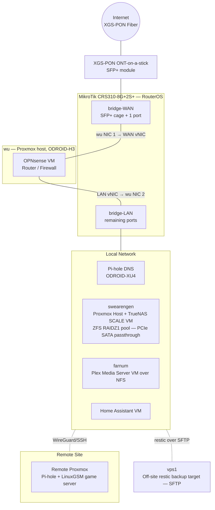

# greenbeanorg — Andy Alexander's Homelab

Multi-site homelab infrastructure, documented as production-style runbooks. I'm a Linux systems administrator and this is where I design, break, fix, and document infrastructure.

**Everything here is real and running** — three Proxmox hosts across two sites, ZFS storage on TrueNAS SCALE, OPNsense edge routing over XGS-PON fiber, automated verified backups, and a containerized service stack.

## Repositories

| Repo | What it is |
|---|---|
| [homelab-docs](https://github.com/greenbeanorg/homelab-docs) | Runbooks and design docs: storage, backup, networking, power, services |
| [homelab](https://github.com/greenbeanorg/homelab) | Sanitized configs: Docker Compose stacks, NUT, restic scripts, tooling |

## Network at a glance

**Traffic path:** fiber terminates on the ONT SFP+ in the switch's isolated **bridge-WAN**, which hands off to a dedicated NIC on `wu`; the OPNsense VM routes/firewalls and sends LAN-bound traffic out a second NIC back into the switch's **bridge-LAN** — router-on-a-VM with a physical hairpin through the CRS310.

## Current projects

- **Ansible fleet management** — converting host configuration (baseline, NUT, restic, Docker hosts) to roles across all sites
- **Monitoring modernization** — Prometheus + Grafana + node_exporter fleet-wide
- **VLAN segmentation** — redesigning the flat L2 network into trust zones on the CRS310

## Recently completed

- 30TB storage migration: mdadm RAID5 → TrueNAS SCALE / ZFS RAIDZ1 with PCIe SATA passthrough ([runbook](https://github.com/greenbeanorg/homelab-docs))
- SSHFS → NFS for all cross-host storage access
- Automated restic backups across all sites with 90-day retention and scheduled integrity verification
- PowerPanel (pwrstat) → NUT UPS monitoring conversion (in progress, one host complete)
- Beta tester for XGS-PON ONT-on-a-stick ([pon.wiki guide](https://pon.wiki/guides/masquerade-as-the-att-inc-bgw320-500-505-with-the-was-110/))

---
📫 andy.alexander@gmail.com · Ormond Beach, FL · open to remote systems/NOC roles
