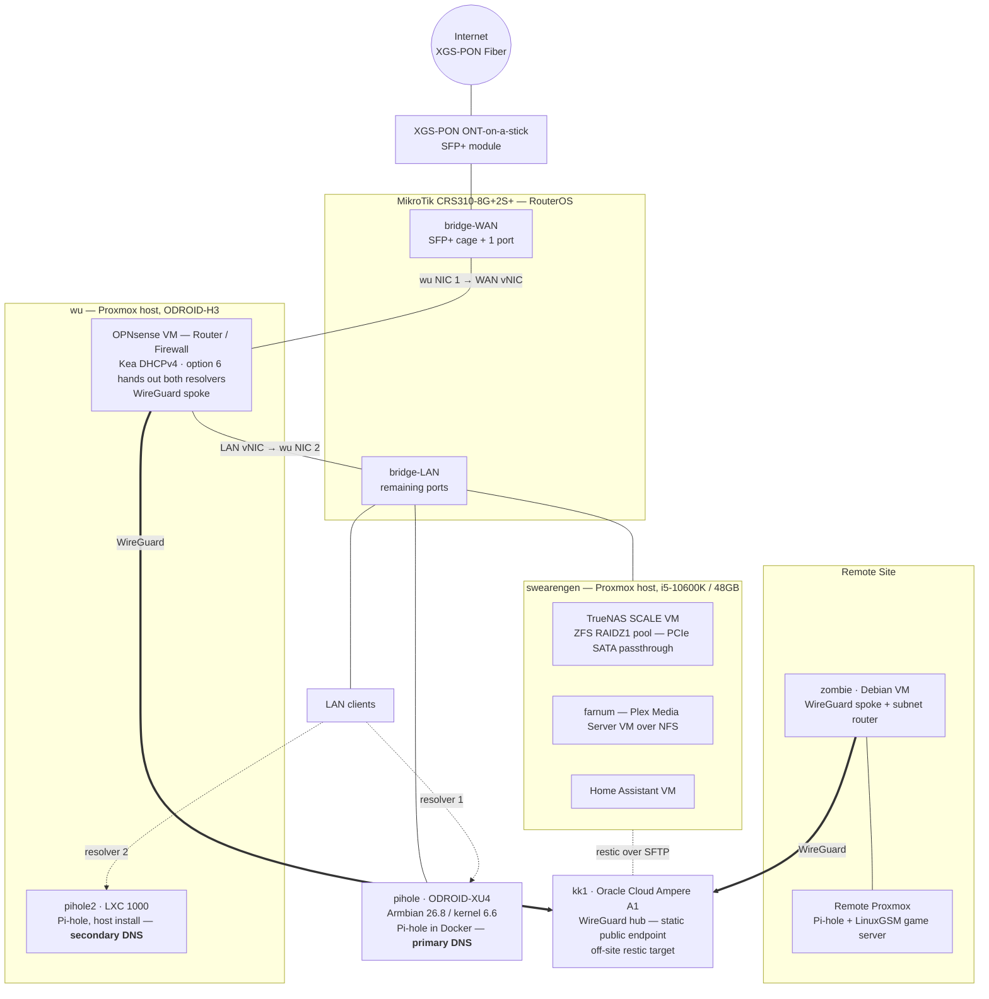

# greenbeanorg — Linux Infrastructure Lab

Systems Engineer / Network & Infrastructure Engineer

Multi-site Linux infrastructure lab focused on automation, virtualization, networking, storage, monitoring, backup/recovery, and operational reliability.

Everything here is real infrastructure that I design, automate, break, recover, and document.

## Repositories

**[homelab-docs](https://github.com/greenbeanorg/homelab-docs)** — runbooks and design
docs covering storage, backup, networking, power, and services. Each one records what was
built, why that approach, what broke, and how to rebuild it from nothing.

## Network at a glance

```mermaid
flowchart TB
    INET((Internet<br/>XGS-PON Fiber))
    ONT[XGS-PON ONT-on-a-stick<br/>SFP+ module]

    subgraph SW [MikroTik CRS310-8G+2S+ — RouterOS]
        BW[bridge-WAN<br/>SFP+ cage + 1 port]
        BL[bridge-LAN<br/>remaining ports]
    end

    subgraph WU [wu — Proxmox host, ODROID-H3]
        FW[OPNsense VM — Router / Firewall<br/>Kea DHCPv4 · option 6 hands out both resolvers<br/>WireGuard spoke]
        PH2[pihole2 · LXC 1000<br/>Pi-hole, host install — <b>secondary DNS</b>]
    end

    PH1[pihole · ODROID-XU4<br/>Armbian 26.8 / kernel 6.6<br/>Pi-hole in Docker — <b>primary DNS</b>]

    subgraph SWG [swearengen — Proxmox host, i5-10600K / 48GB]
        NAS[TrueNAS SCALE VM<br/>ZFS RAIDZ1 pool — PCIe SATA passthrough]
        FARN[farnum — Plex Media Server VM over NFS]
        HA[Home Assistant VM]
    end

    CLIENTS[LAN clients]

    KK1[kk1 · Oracle Cloud Ampere A1<br/>WireGuard hub — static public endpoint<br/>off-site restic target]

    subgraph REMOTE [Remote Site]
        ZOM[zombie · Debian VM<br/>WireGuard spoke + subnet router]
        RPX[Remote Proxmox<br/>Pi-hole + LinuxGSM game server]
    end

    INET --- ONT --- BW
    BW ---|"wu NIC 1 → WAN vNIC"| FW
    FW ---|"LAN vNIC → wu NIC 2"| BL
    BL --- CLIENTS
    BL --- PH1
    BL --- SWG
    CLIENTS -. "resolver 1" .-> PH1
    CLIENTS -. "resolver 2" .-> PH2
    FW == "WireGuard" ==> KK1
    ZOM == "WireGuard" ==> KK1
    ZOM --- RPX
    SWG -. restic over SFTP .- KK1
```

**Traffic path:** fiber terminates on the ONT SFP+ in the switch's isolated
**bridge-WAN**, which hands off to a dedicated NIC on `wu`; the OPNsense VM
routes/firewalls and sends LAN-bound traffic out a second NIC back into the
switch's **bridge-LAN** — router-on-a-VM with a physical hairpin through the
CRS310.

**DNS resiliency:** Kea DHCPv4 on OPNsense advertises two Pi-hole resolvers via
option 6 (`domain-name-servers`), deliberately placed in **different failure
domains** — the primary is a standalone ODROID-XU4, the secondary an LXC on
`wu`. Neither sits on `swearengen`, so storage and hypervisor maintenance never
touches name resolution. Full design and rebuild procedure:
**[DNS.md](https://github.com/greenbeanorg/homelab-docs/blob/main/DNS.md)**.

| | Primary | Secondary |
| --- | --- | --- |
| Host | `pihole` — ODROID-XU4, Armbian | `pihole2` — LXC 1000 on `wu` |
| Address | `10.x.x.250` | `10.x.x.249` |
| Install method | Docker, pinned image tag | Host install (`curl \| bash`) |
| Failure domain | Standalone ARM SBC | Proxmox guest, router host |
| Config source of truth | Teleporter export | Teleporter import from primary |

## Recently completed

- Multi-site WireGuard overlay: hub-and-spoke through a cloud instance, so neither residential site needs inbound reachability — subnet routing to a second site plus full-tunnel roaming clients ([runbook](https://github.com/greenbeanorg/homelab-docs/blob/main/WIREGUARD.md))
- Declarative availability monitoring: Uptime Kuma with the monitor set defined in YAML and reconciled by script, so it's version-controlled rather than click-configured ([runbook](https://github.com/greenbeanorg/homelab-docs/blob/main/UPTIME-KUMA.md))
- Redundant DNS resolvers in separate failure domains, advertised by OPNsense Kea DHCPv4 option 6 ([runbook](https://github.com/greenbeanorg/homelab-docs/blob/main/DNS.md))
- 30TB storage migration: mdadm RAID5 → TrueNAS SCALE / ZFS RAIDZ1 with PCIe SATA passthrough ([runbook](https://github.com/greenbeanorg/homelab-docs/blob/main/TRUENAS.md))
- NFS for all cross-host storage access

## Current projects

- **Ansible fleet management — converting host configuration to reusable roles across sites.
- **Monitoring modernization — migrating fleet monitoring toward Prometheus, Grafana, and node_exporter.
- **VLAN segmentation — redesigning the flat L2 network into trust zones on the CRS310.
- **Off-site backup rebuild — reconstructing restic repository paths following the TrueNAS/ZFS migration.

---
Ormond Beach, FL · open to remote syseng roles
