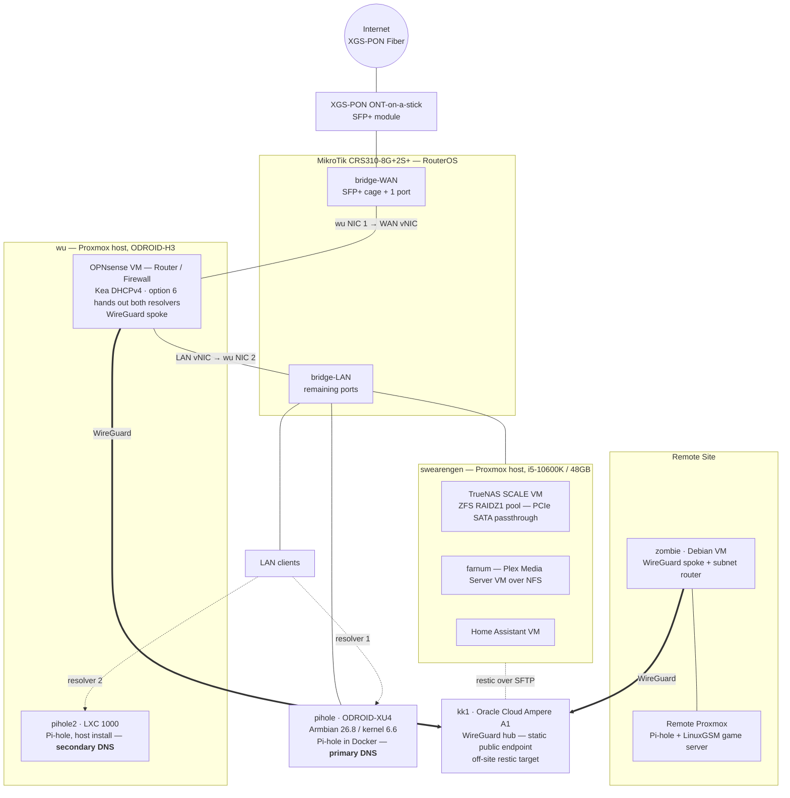

# Network & Infrastructure

Multi-site Linux infrastructure lab: three Proxmox hosts across two sites, OPNsense edge routing
over XGS-PON fiber, ZFS on TrueNAS SCALE, a WireGuard overlay, and a containerized service stack.
**19 runbooks, ~6,300 lines** — each records what was built, why that approach, what broke, and how
to rebuild it from nothing.

**Stack:** Proxmox VE · KVM/LXC · Debian / Rocky / Fedora / Armbian · ZFS · TrueNAS SCALE · NFS/SMB ·
OPNsense · MikroTik RouterOS · VLANs · Kea DHCP · Pi-hole · Unbound · WireGuard · Docker Compose ·
Ansible · Terraform · Python · NetBox · Uptime Kuma · restic · NUT · Wazuh · Git

---

## Documentation index — [greenbeanorg/homelab-docs](https://github.com/greenbeanorg/homelab-docs)

### System Automation
| Doc | Covers |
| --- | --- |
| [TERRAFORM-PROXMOX-FIRST-APPLY-2026-09.md](https://github.com/greenbeanorg/homelab-docs/blob/main/TERRAFORM-PROXMOX-FIRST-APPLY-2026-09.md) | First Terraform + Proxmox LXC provisioning pass from dority; covers cert/hostname drift and API token permission scoping gotchas |

### System Troubleshooting
| Doc | Covers |
| --- | --- |
| [TRUENAS-NETDATA-NUT-REMOTE-UPS-2026-09.md](https://github.com/greenbeanorg/homelab-docs/blob/main/TRUENAS-NETDATA-NUT-REMOTE-UPS-2026-09.md) | Netdata’s nut_ups collector was failing against the remote NUT server. Disabled the redundant collector and used Netdata’s working nut collector with the remote UPS endpoint configured directly.
| [PIHOLE-KUMA-AUTH-OUTAGE.md](https://github.com/greenbeanorg/homelab-docs/blob/main/PIHOLE-KUMA-AUTH-OUTAGE.md) | Pi-hole v6 session-auth outage — root cause, Push monitor migration, session-leak fix |
| [SWEARENGEN-VMBR0-INTRA-BRIDGE-FORWARDING-BUG-2026-09.md](https://github.com/greenbeanorg/homelab-docs/blob/main/SWEARENGEN-VMBR0-INTRA-BRIDGE-FORWARDING-BUG-2026-09.md) | Workaround in place, root cause unresolved. Same-host VM-to-VM TCP flow silently dropped by vmbr0's intra-bridge forwarding for one specific VM pair, despite clean firewall/VLAN/FDB/physical-network state at every layer checked. Fixed by routing the flow through OPNsense instead of the local bridge. |
| [SWEARENGEN-USB-CONTROLLER-HANG-2026-09.md](https://github.com/greenbeanorg/homelab-docs/blob/main/SWEARENGEN-USB-CONTROLLER-HANG-2026-09.md) | **Resolved.** Root-cause runbook for a full hypervisor hang on swearengen (i5-10600K/48GB, primary Proxmox host) traced to a wedged USB controller shared between the UPS and other USB peripherals. Fix was moving the UPS off swearengen entirely — see UPS.md.

### Monitoring
| Doc | Covers |
| --- | --- |
| [UPTIME-KUMA.md](https://github.com/greenbeanorg/homelab-docs/blob/main/UPTIME-KUMA.md) | Declarative availability monitoring — monitors defined in YAML and reconciled into Uptime Kuma by a Python script, so the monitor set is version-controlled rather than click-configured |

### Networking
| Doc | Covers |
| --- | --- |
| [VLAN-SEGMENTATION.md](https://github.com/greenbeanorg/homelab-docs/blob/main/VLAN-SEGMENTATION.md) | Migration of greenbean.org from a flat 10.x.x.N/24 to a segmented VLAN network on 10.79.x.x. Covers the CRS310, a new TL-SG108E access switch, OPNsense, both Proxmox hosts, and the EAP610 AP.
| [DNS.md](https://github.com/greenbeanorg/homelab-docs/blob/main/DNS.md) | Redundant Pi-hole resolvers in separate failure domains, advertised by Kea DHCPv4 option 6 — address-space layout, Teleporter parity, the static-host audit procedure, and the failure modes DHCP resolver lists actually have |
| [ODROID-XU4.md](https://github.com/greenbeanorg/homelab-docs/blob/main/ODROID-XU4.md) | Rebuilding the DNS host off an orphaned Hardkernel vendor kernel onto maintained Armbian — why a release upgrade was rejected, U-Boot's fixed-filename boot flow, and the eMMC reflash with a rollback path |
| [PIHOLE-DOCKER.md](https://github.com/greenbeanorg/homelab-docs/blob/main/PIHOLE-DOCKER.md) | First-build procedure for the primary Pi-hole container on bare Armbian — freeing :53 from systemd-resolved, armhf image constraints, compose layout, and the initial Teleporter import |
| [UNBOUND.md](https://github.com/greenbeanorg/homelab-docs/blob/main/UNBOUND.md) | Per-host recursive, DNSSEC-validating resolver replacing Quad9 as upstream on both Pi-holes — install, validation, cutover, and rollback |
| [WIREGUARD.md](https://github.com/greenbeanorg/homelab-docs/blob/main/WIREGUARD.md) | Multi-site overlay network — hub-and-spoke WireGuard through a cloud instance so neither residential endpoint needs inbound reachability, with subnet routing to a second site and full-tunnel roaming clients |

### Storage
| Doc | Covers |
| --- | --- |
| [NVME-HEALTH-CHECK.md](https://github.com/greenbeanorg/homelab-docs/NVME-HEALTH-CHECK.md) | A script to briefly check the health of proxmox hosts nvme drives
| [TRUENAS.md](https://github.com/greenbeanorg/homelab-docs/blob/main/TRUENAS.md) | 30 TB storage migration — mdadm RAID5 → TrueNAS SCALE / ZFS RAIDZ1, with PCIe SATA controller passthrough, pool and dataset design, and dual SMB/NFS shares under a unified identity |
| [SMART-DOCTOR.md](https://github.com/greenbeanorg/homelab-docs/blob/main/SMART-DOCTOR.md) | Using smartmontools to establish a base health for the 4 x 10TB NAS drives.
| [TRUENAS-UPS-REPORTING.md](https://github.com/greenbeanorg/homelab-docs/blob/main/TRUENAS-UPS-REPORTING.md) | Why the TrueNAS reporting page stays blank when NUT runs in netclient mode (NAS-132924) — the charts.d module that assumes a local `upsd`, a config override that fixes it without touching the immutable rootfs, and an init script to survive OS upgrades |
| [UPS.md](https://github.com/greenbeanorg/homelab-docs/blob/main/UPS.md) | UPS monitoring via NUT, primary relocated to a dedicated Pi 2B with staggered shutdown ordering across three hosts (TrueNAS first, swearengen last) |

### Experimental / early-stage
| Doc | Covers |
| --- | --- |
| [NETBOX.md](https://github.com/greenbeanorg/homelab-docs/blob/main/NETBOX.md) | NetBox, PostgreSQL, and Valkey through Docker Compose.
| [NETBOX-INVENTORY.md](https://github.com/greenbeanorg/homelab-docs/blob/main/NETBOX-INVENTORY.md) | Netbox python inventory script fed by a simple yaml
| [LAN-DEVICE-WATCHER.md](https://github.com/greenbeanorg/homelab-docs/blob/main/LAN-DEVICE-WATCHER.md) | A crude Node.js LAN scanner

---

## Network at a glance

```mermaid
flowchart TB
    INET((Internet<br/>XGS-PON Fiber))
    ONT[XGS-PON ONT-on-a-stick<br/>SFP+ module]

    subgraph SW [MikroTik CRS310-8G+2S+ — RouterOS]
        BW[bridge-WAN<br/>SFP+ cage + 1 port]
        BL[bridge-LAN<br/>remaining ports]
    end

    subgraph WU [wu — Proxmox host, ODROID-H3]
        FW[OPNsense VM — Router / Firewall<br/>Kea DHCPv4 · option 6 hands out both resolvers<br/>WireGuard spoke]
        PH2[pihole2 · LXC 1000<br/>Pi-hole, host install — <b>secondary DNS</b>]
    end

    PH1[pihole · ODROID-XU4<br/>Armbian 26.8 / kernel 6.6<br/>Pi-hole in Docker — <b>primary DNS</b>]

    subgraph SWG [swearengen — Proxmox host, i5-10600K / 48GB]
        NAS[TrueNAS SCALE VM<br/>ZFS RAIDZ1 pool — PCIe SATA passthrough]
        FARN[farnum — Plex Media Server VM over NFS]
        HA[Home Assistant VM]
    end

    CLIENTS[LAN clients]

    KK1[kk1 · Oracle Cloud Ampere A1<br/>WireGuard hub — static public endpoint<br/>off-site restic target]

    subgraph REMOTE [Remote Site]
        ZOM[zombie · Debian VM<br/>WireGuard spoke + subnet router]
        RPX[Remote Proxmox<br/>Pi-hole + LinuxGSM game server]
    end

    INET --- ONT --- BW
    BW ---|"wu NIC 1 → WAN vNIC"| FW
    FW ---|"LAN vNIC → wu NIC 2"| BL
    BL --- CLIENTS
    BL --- PH1
    BL --- SWG
    CLIENTS -. "resolver 1" .-> PH1
    CLIENTS -. "resolver 2" .-> PH2
    FW == "WireGuard" ==> KK1
    ZOM == "WireGuard" ==> KK1
    ZOM --- RPX
    SWG -. restic over SFTP .- KK1
```

**Traffic path:** fiber terminates on the ONT SFP+ in the switch's isolated
**bridge-WAN**, which hands off to a dedicated NIC on `wu`; the OPNsense VM
routes/firewalls and sends LAN-bound traffic out a second NIC back into the
switch's **bridge-LAN** — router-on-a-VM with a physical hairpin through the
CRS310.

**DNS resiliency:** Kea DHCPv4 on OPNsense advertises two Pi-hole resolvers via
option 6 (`domain-name-servers`), deliberately placed in **different failure
domains** — the primary is a standalone ODROID-XU4, the secondary an LXC on
`wu`. Neither sits on `swearengen`, so storage and hypervisor maintenance never
touches name resolution. Full design and rebuild procedure:
**[DNS.md](https://github.com/greenbeanorg/homelab-docs/blob/main/DNS.md)**.

| | Primary | Secondary |
| --- | --- | --- |
| Host | `pihole` — ODROID-XU4, Armbian | `pihole2` — LXC 1000 on `wu` |
| Address | `10.x.x.250` | `10.x.x.249` |
| Install method | Docker, pinned image tag | Host install (`curl \| bash`) |
| Failure domain | Standalone ARM SBC | Proxmox guest, router host |
| Config source of truth | Teleporter export | Teleporter import from primary |

---

## Recently completed

- **VLAN segmentation** — flat 10.0.0.0/24 rebuilt into a segmented VLAN network (10.79.x.x) across the CRS310, OPNsense, both Proxmox hosts, and the EAP610 AP
- **First Terraform + Proxmox provisioning pass** — declarative LXC provisioning from a dedicated dev box
- **Resolved a full hypervisor hang** on the primary Proxmox host, root-caused to a wedged USB controller shared with UPS monitoring
- **Migrated availability monitoring** off broken unauthenticated Pi-hole checks to authenticated Push-based monitors after a Pi-hole v6 auth change
- **Per-host recursive, DNSSEC-validating DNS** — Unbound replacing Quad9 as upstream on both Pi-holes
- **Multi-site WireGuard overlay** — hub-and-spoke through a cloud instance, so neither residential site needs inbound reachability; subnet routing to a second site plus full-tunnel roaming clients
- **Declarative availability monitoring** — Uptime Kuma with the monitor set defined in YAML and reconciled by script, version-controlled rather than click-configured
- **Redundant DNS resolvers** in separate failure domains, advertised by OPNsense Kea DHCPv4 option 6
- **30 TB storage migration** — mdadm RAID5 → TrueNAS SCALE / ZFS RAIDZ1 with PCIe SATA passthrough
- **NFS** for all cross-host storage access

## Current projects

- **Ansible fleet management** — converting host configuration to reusable roles across sites
- **Extending Terraform** coverage across the rest of the Proxmox fleet
- **Monitoring modernization** — migrating fleet monitoring toward Prometheus, Grafana, and node_exporter
- **Off-site backup rebuild** — reconstructing restic repository paths following the TrueNAS/ZFS migration

## Repositories

**[homelab-docs](https://github.com/greenbeanorg/homelab-docs)** — the runbooks indexed above.

---
Ormond Beach, FL · open to remote systems / infrastructure engineering roles
