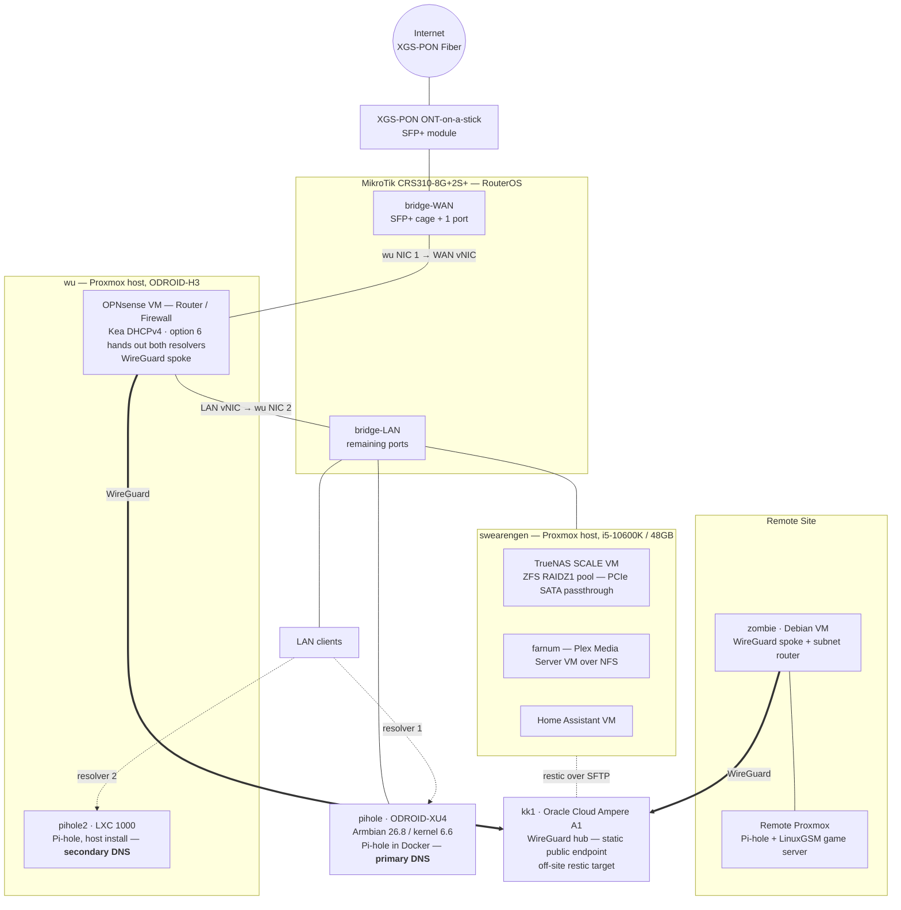

# Systems Engineer — Network & Infrastructure

Multi-site Linux infrastructure lab: three Proxmox hosts across two sites, OPNsense edge routing
over XGS-PON fiber, ZFS on TrueNAS SCALE, a WireGuard overlay, and a containerized service stack.
**15 runbooks, ~5,500 lines** — each records what was built, why that approach, what broke, and how
to rebuild it from nothing.

**Stack:** Proxmox VE · KVM/LXC · Debian / Rocky / Fedora / Armbian · ZFS · TrueNAS SCALE · NFS/SMB ·
OPNsense · MikroTik RouterOS · VLANs · Kea DHCP · Pi-hole · Unbound · WireGuard · Docker Compose ·
Ansible · Python · NetBox · Uptime Kuma · restic · NUT · Wazuh · Git

---

## Documentation index — [greenbeanorg/homelab-docs](https://github.com/greenbeanorg/homelab-docs)

### Networking

| Runbook | Covers |
| --- | --- |
| [VLAN-SEGMENTATION.md](https://github.com/greenbeanorg/homelab-docs/blob/main/VLAN-SEGMENTATION.md) | Flat L2 → segmented trust zones across the CRS310, OPNsense, both Proxmox hosts, an access switch, and the APs |
| [DNS.md](https://github.com/greenbeanorg/homelab-docs/blob/main/DNS.md) | Redundant Pi-hole resolvers in separate failure domains, advertised by Kea DHCPv4 option 6 — plus the failure modes DHCP resolver lists actually have |
| [UNBOUND.md](https://github.com/greenbeanorg/homelab-docs/blob/main/UNBOUND.md) | Per-host recursive, DNSSEC-validating resolver replacing the public upstream on both Pi-holes — validation, cutover, rollback |
| [PIHOLE-DOCKER.md](https://github.com/greenbeanorg/homelab-docs/blob/main/PIHOLE-DOCKER.md) | Primary resolver build on bare Armbian — freeing `:53` from systemd-resolved, armhf image constraints, compose layout |
| [ODROID-XU4.md](https://github.com/greenbeanorg/homelab-docs/blob/main/ODROID-XU4.md) | Moving the DNS host off an orphaned vendor kernel onto maintained Armbian — U-Boot boot flow and an eMMC reflash with a rollback path |
| [WIREGUARD.md](https://github.com/greenbeanorg/homelab-docs/blob/main/WIREGUARD.md) | Hub-and-spoke overlay through a cloud instance so neither residential site needs inbound reachability — subnet routing plus roaming full-tunnel clients |
| [IPV6.md](https://github.com/greenbeanorg/homelab-docs/blob/main/IPV6.md) | Per-VLAN `/64` allocation plan out of the delegated prefix |

### System Troubleshooting
| Doc | Covers |
| --- | --- |
| [SWEARENGEN-USB-CONTROLLER-HANG-2026-09.md](https://github.com/greenbeanorg/homelab-docs/blob/SWEARENGEN-USB-CONTROLLER-HANG-2026-09.md) | Root-cause runbook for a full hypervisor hang on swearengen (i5-10600K/48GB, primary Proxmox host) traced to a wedged USB controller shared between the UPS and other USB peripherals.

### Monitoring & inventory

| Runbook | Covers |
| --- | --- |
| [UPTIME-KUMA.md](https://github.com/greenbeanorg/homelab-docs/blob/main/UPTIME-KUMA.md) | Declarative availability monitoring — monitors defined in YAML and reconciled by a Python script, so the monitor set is version-controlled rather than click-configured |
| [NETBOX.md](https://github.com/greenbeanorg/homelab-docs/blob/main/NETBOX.md) | NetBox with PostgreSQL and Valkey on Docker Compose as the fleet source of truth |
| [NETBOX-INVENTORY.md](https://github.com/greenbeanorg/homelab-docs/blob/main/NETBOX-INVENTORY.md) | YAML-driven inventory population — idempotent create/update/no-op, non-destructive by design |
| [LAN-DEVICE-WATCHER.md](https://github.com/greenbeanorg/homelab-docs/blob/main/LAN-DEVICE-WATCHER.md) | Containerized LAN discovery on the Docker host — sweeps the segment and surfaces devices that aren't in inventory |

### Storage & power

| Runbook | Covers |
| --- | --- |
| [TRUENAS.md](https://github.com/greenbeanorg/homelab-docs/blob/main/TRUENAS.md) | 30 TB migration, mdadm RAID5 → TrueNAS SCALE / ZFS RAIDZ1 — PCIe SATA controller passthrough, pool and dataset design, dual SMB/NFS shares under a unified identity |
| [SMART-DOCTOR.md](https://github.com/greenbeanorg/homelab-docs/blob/main/SMART-DOCTOR.md) | smartmontools health baseline and extended self-test management across the 4 × 10 TB pool |
| [TRUENAS-UPS-REPORTING.md](https://github.com/greenbeanorg/homelab-docs/blob/main/TRUENAS-UPS-REPORTING.md) | Root-causing blank UPS charts under NUT netclient mode (NAS-132924) — a config override that avoids the immutable rootfs and survives OS upgrades |
| [UPS.md](https://github.com/greenbeanorg/homelab-docs/blob/main/UPS.md) | UPS monitoring conversion from PowerPanel (`pwrstat`) to NUT |

Every doc follows the same shape: summary block, numbered sections, a known-limitations section
where the honest tradeoffs go, and a quick-reference table for the things you look up at 2am.
Sanitization is enforced by a pre-commit hook, not by memory.

---

## Network at a glance

```mermaid
flowchart TB
    INET((Internet<br/>XGS-PON Fiber))
    ONT[XGS-PON ONT-on-a-stick<br/>SFP+ module]

    subgraph SW [MikroTik CRS310-8G+2S+ — RouterOS]
        BW[bridge-WAN<br/>SFP+ cage + 1 port]
        BL[bridge-LAN<br/>remaining ports]
    end

    subgraph WU [wu — Proxmox host, ODROID-H3]
        FW[OPNsense VM — Router / Firewall<br/>Kea DHCPv4 · option 6 hands out both resolvers<br/>WireGuard spoke]
        PH2[pihole2 · LXC 1000<br/>Pi-hole, host install — <b>secondary DNS</b>]
    end

    PH1[pihole · ODROID-XU4<br/>Armbian 26.8 / kernel 6.6<br/>Pi-hole in Docker — <b>primary DNS</b>]

    subgraph SWG [swearengen — Proxmox host, i5-10600K / 48GB]
        NAS[TrueNAS SCALE VM<br/>ZFS RAIDZ1 pool — PCIe SATA passthrough]
        FARN[farnum — Plex Media Server VM over NFS]
        HA[Home Assistant VM]
    end

    CLIENTS[LAN clients]

    KK1[kk1 · Oracle Cloud Ampere A1<br/>WireGuard hub — static public endpoint<br/>off-site restic target]

    subgraph REMOTE [Remote Site]
        ZOM[zombie · Debian VM<br/>WireGuard spoke + subnet router]
        RPX[Remote Proxmox<br/>Pi-hole + LinuxGSM game server]
    end

    INET --- ONT --- BW
    BW ---|"wu NIC 1 → WAN vNIC"| FW
    FW ---|"LAN vNIC → wu NIC 2"| BL
    BL --- CLIENTS
    BL --- PH1
    BL --- SWG
    CLIENTS -. "resolver 1" .-> PH1
    CLIENTS -. "resolver 2" .-> PH2
    FW == "WireGuard" ==> KK1
    ZOM == "WireGuard" ==> KK1
    ZOM --- RPX
    SWG -. restic over SFTP .- KK1
```

**Traffic path:** fiber terminates on the ONT SFP+ in the switch's isolated
**bridge-WAN**, which hands off to a dedicated NIC on `wu`; the OPNsense VM
routes/firewalls and sends LAN-bound traffic out a second NIC back into the
switch's **bridge-LAN** — router-on-a-VM with a physical hairpin through the
CRS310.

**DNS resiliency:** Kea DHCPv4 on OPNsense advertises two Pi-hole resolvers via
option 6 (`domain-name-servers`), deliberately placed in **different failure
domains** — the primary is a standalone ODROID-XU4, the secondary an LXC on
`wu`. Neither sits on `swearengen`, so storage and hypervisor maintenance never
touches name resolution. Full design and rebuild procedure:
**[DNS.md](https://github.com/greenbeanorg/homelab-docs/blob/main/DNS.md)**.

| | Primary | Secondary |
| --- | --- | --- |
| Host | `pihole` — ODROID-XU4, Armbian | `pihole2` — LXC 1000 on `wu` |
| Address | `10.x.x.250` | `10.x.x.249` |
| Install method | Docker, pinned image tag | Host install (`curl \| bash`) |
| Failure domain | Standalone ARM SBC | Proxmox guest, router host |
| Config source of truth | Teleporter export | Teleporter import from primary |

---

## Recently completed

- **Multi-site WireGuard overlay** — hub-and-spoke through a cloud instance, so neither residential site needs inbound reachability; subnet routing to a second site plus full-tunnel roaming clients
- **Declarative availability monitoring** — Uptime Kuma with the monitor set defined in YAML and reconciled by script, version-controlled rather than click-configured
- **Redundant DNS resolvers** in separate failure domains, advertised by OPNsense Kea DHCPv4 option 6, with per-host Unbound recursion underneath
- **30 TB storage migration** — mdadm RAID5 → TrueNAS SCALE / ZFS RAIDZ1 with PCIe SATA passthrough
- **NFS** for all cross-host storage access

## Current projects

- **VLAN segmentation** — redesigning the flat L2 network into trust zones on the CRS310, OPNsense, and both hypervisors
- **Ansible fleet management** — converting host configuration to reusable roles across sites
- **Monitoring modernization** — migrating fleet monitoring toward Prometheus, Grafana, and node_exporter
- **Off-site backup rebuild** — reconstructing restic repository paths following the TrueNAS/ZFS migration

## Repositories

**[homelab-docs](https://github.com/greenbeanorg/homelab-docs)** — the runbooks indexed above.
**[homelab](https://github.com/greenbeanorg/homelab)** — sanitized configs and automation.

---
Ormond Beach, FL · open to remote systems / infrastructure engineering roles
